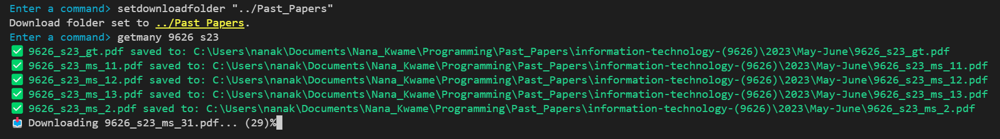

# EasyPastPapers

[](LICENSE)

> **EasyPastPapers** is a command-line tool to easily download CIE Past Exam Papers for IGCSE, O-Level, and A-Level by web scraping from [papers.gceguide.cc](https://papers.gceguide.cc).

---


*<!-- Replace with an actual banner image if available -->*

## Features

- Download individual or multiple past papers by code or range
- Supports IGCSE, O-Level, and A-Level subjects
- Intelligent caching for faster repeated downloads
- Customizable download folder and connection settings
- Cross-platform support (Windows, macOS, Linux) - Windows setup executable provided as of now.
- Interactive CLI with tab completion and helpful error messages

## Installation

### Requirements

- Python 3.11
- [requests](https://pypi.org/project/requests/)
- [beautifulsoup4](https://pypi.org/project/beautifulsoup4/)
- [pyreadline3](https://pypi.org/project/pyreadline3/) (Windows only)

Install dependencies:

```sh
pip install -r requirements.txt
```

### Running from Source

Clone the repository and run:

```sh
python src/main.py
```

### Windows Installer

A Windows installer is available in the releases section.

Can be recompiled on Windows by using pyinstaller.
```sh
pyinstaller src/main.py --noconsole --icon=assets/icon.ico --name="EasyPastPapers"
```
and then running the setup script in the [setup scripts](/setup%20scripts/) folder

## Usage

Start the CLI:

```sh
python src/main.py
```

Example commands:

```sh
get 0452_w04_qp_3
getmany 0580 20-22
setdownloadfolder "C:/Users/YourName/Documents/Past_Papers"
```

Type `help` in the CLI for a full list of commands and usage.

## Command Reference

| Command              | Description                                              |
|----------------------|---------------------------------------------------------|
| `get`                | Download a specific paper by code                       |
| `getmany`            | Download all papers for a subject and range             |
| `setdownloadfolder`  | Set the folder for downloads                            |
| `setbaseurl`         | Change the base URL for downloads                       |
| `setconnecttimeout`  | Set the network connection timeout                      |
| `setreadtimeout`     | Set the network read timeout                            |
| `exit`               | Exit the program                                        |

For detailed usage, type `help <command>` in the CLI.

## Configuration

Configuration is stored in a JSON file at:

- **Windows:** `%APPDATA%\EasyPastPapers\config.json`
- **Linux/macOS:** `~/.config/config.json`

You can edit settings via CLI commands or by editing this file directly.

## Folder Structure

```
EasyPastPapers/
├── src/
│   ├── main.py
│   ├── easypapershell.py
│   ├── configuration.py
│   ├── requesthandler.py
│   ├── cache.py
│   ├── utils.py
│   └── constants.py
├── assets/
│   ├── icon.ico
│   └── icon.png
├── requirements.txt
├── README.md
└── ...
```

## Screenshots

  
Demo 1  
  
Demo 2  
  
Demo 3  

## License

This project is licensed under the [Apache 2.0 License](LICENSE).

---

*For questions or support, contact: nanakampomah@gmail.com*